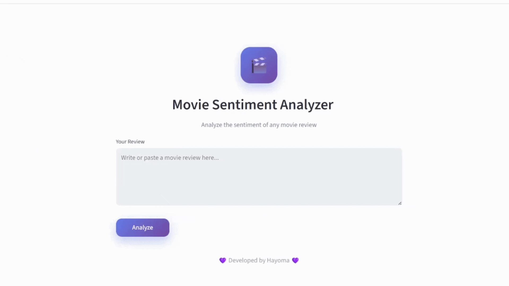

# NLP Sentiment Analyzer

## 📌 Overview

This project is a sentiment analysis system for movie reviews using Natural Language Processing (NLP) and deep learning.
It classifies reviews as **positive or negative** using an LSTM-based model trained on the IMDB dataset.

A Streamlit web application is included for real-time sentiment prediction.

---

## 📊 Dataset

IMDB Movie Reviews Dataset (50K reviews)
[https://www.kaggle.com/datasets/lakshmi25npathi/imdb-dataset-of-50k-movie-reviews](https://www.kaggle.com/datasets/lakshmi25npathi/imdb-dataset-of-50k-movie-reviews)

---

## 🧠 Model Architecture

* Embedding Layer
* LSTM Layer
* Dense Output Layer (Sigmoid activation)

---

## ⚙️ Workflow

1. Data preprocessing (cleaning, removing HTML, normalization)
2. Tokenization using Keras Tokenizer
3. Padding sequences
4. Training LSTM model
5. Evaluation using accuracy and classification report
6. Deployment using Streamlit
---

## 📊 Results

* Accuracy: 87%
* Precision: 0.87 / 0.86
* Recall: 0.86 / 0.88
* F1-score: 0.87

The model shows balanced performance across both classes with good generalization.

---

## 🎥 Demo

Streamlit app for real-time prediction:

---

## 🛠️ Technologies

* Python
* TensorFlow / Keras
* NLTK
* Scikit-learn
* Pandas / NumPy
* Streamlit
